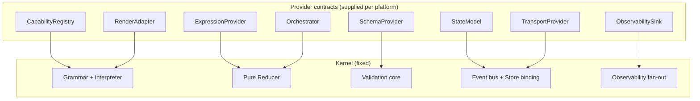

# Generative Interaction Kernel

A generic platform layer for **generative, declarative UI** — a kernel that interprets a
portable UI-intent document into a running, reactive interface, while delegating everything
domain- and framework-specific to pluggable providers.

> The kernel owns the *invariants* (grammar, validation, reduction). Everything domain-specific
> — which components exist, what data means, which LLM authors it, which framework renders it —
> is supplied as a **provider**. A concrete platform = **kernel + one implementation of each provider**.

## Runtime layers at a glance

One confusion this repo now resolves explicitly: the kernel is not the whole runtime edge.

| Layer | What it is | Use it when… |
|---|---|---|
| **Kernel / engine** | the embeddable execution core | you want local runtime authority and deterministic execution in-process |
| **Face** | the internal callable surface around pure helpers and/or a live kernel | you are implementing shared projection machinery |
| **Projection** | the outward policy view over that face | you want an agent-safe subset vs a full control-plane catalog |
| **Transport** | the wire carrier for a chosen projection | you need HTTP/SSE/MCP/process boundaries |

In this repo, the concrete shape is:

- [kernel](kernel) = the engine
- [face](face) = the internal shared composition layer behind the public projections
- [packages/kernel](packages/kernel) = the public `@gik/kernel` package
- [packages/controlface](packages/controlface) = the public `@gik/controlface` package
- [packages/agentface](packages/agentface) = the public `@gik/agentface` package
- [packages/react](packages/react) = the public `@gik/react` package
- [packages/components](packages/components) = the public Fluent 2 `@gik/components` package
- [packages/provider-step-orchestrator](packages/provider-step-orchestrator) = the public `@gik/provider-step-orchestrator` package
- [packages/provider-profile-authoring](packages/provider-profile-authoring) = the public `@gik/provider-profile-authoring` package
- [packages/transport-http-sse](packages/transport-http-sse) = the public `@gik/transport-http-sse` package
- [packages/transport-mcp-http](packages/transport-mcp-http) = the public `@gik/transport-mcp-http` package
- [transports](transports) = the internal transport implementations that the public transport packages wrap
- [samples](samples) = thin outer composition showing how to mount those pieces together

If you are deciding what to consume:

- embed the **kernel** when your product should be the runtime authority;
- consume **controlface** or **agentface** when you want a bounded surface over an already-running runtime;
- add a **transport** only when that surface must cross a process/network boundary.

## Sample applications

Run `npm run dev:host` in [generative-interaction-kernel](.) and open a hosted Blueprint with
`/?b=<id>`; the application switcher lists the approved Blueprint catalog. Without a `b` parameter
the host renders its own application root page: a plain React/Fluent layout that places two named
presentation regions — the Blueprint catalog and a live preview — exported by one embedded
Blueprint Studio instance. The same host serves the semantic component Storybook at `/storybook/`;
no second development server is required. Host development and production builds generate the
Storybook assets first and include them in the host artifact.

The sample host defaults to [`samples/config/host.production.json`](samples/config/host.production.json)
in both development and production modes. Use `npm run dev:host:local` or
`npm run build:host:local` to opt into [`samples/config/host.local.json`](samples/config/host.local.json).
`VITE_GIK_HOST_ENV=local|production` is also available as an explicit override.
For local Foundry-backed samples, start the sibling Function host with `npm run dev:foundry-proxy`
in one terminal and run `npm run dev:host` in another. The local proxy listens on
`http://localhost:7071`.

To run every Function app declared by the local host configuration, use `npm run func:local`.
The command reads each origin from `samples/config/host.local.json` and starts the sibling Function
apps on those ports.

Use `npm run dev` for the complete local stack. It starts those Function apps and the Vite host
together, explicitly setting `VITE_GIK_HOST_ENV=local` for the host process. Stopping either process
stops the other.

Run `npx tsx samples/examples/structure-modes/structure-modes.ts` for a headless, deterministic demonstration
of Blueprint structure modes through ControlFace. It shows fixed rejecting a structural change,
reconfigurable ignoring ordinary runtime activity but accepting an authorized reconfiguration, and
adaptive applying a policy-admitted runtime program patch and restoring it from a checkpoint.

### Live portfolio intelligence

The portfolio tracker routes `analyze` and `propose-strategies` through QueueFace. Its Blueprint declares a `deterministic-agent` service for offline execution and attaches the operations to the producing cells. Live deployments replace that declaration with a host-supported kind such as `foundry-agent`; endpoints, model/agent selection, and credential references belong to the Blueprint declaration, while the host authorizes kinds, endpoint origins, and credential resolution.

The endpoint accepts `POST` JSON containing `service`, `version`, `operation`, `input`, and `correlationId`, and returns `{ "output": ... }`. The proxy owns credentials and model/provider configuration; do not expose provider secrets through Vite environment variables. A configured live endpoint is never silently replaced by the deterministic provider when a request fails.

- `/` — application root page: React chrome plus the embedded Studio's catalog and preview regions
- `/?b=portfolio-tracker-new` — live portfolio intelligence
- `/?b=live-workspace-soc` — governed SOC collaboration
- `/?b=ai-agent` — provider-selected agent conversation (`ai=foundry` or `ai=copilot`)
- `/?b=blueprint-studio` — Blueprint catalog studio (the complete Studio, at its own root)
- `/?b=manage-bundles` — Bundle artifact catalog and preview

## Status

Early implementation. The architecture and the wire protocol (**GIK Protocol / GIK**) are
defined; the normative schemas + golden conformance fixture, a **reference kernel** (Phase 1), a
first **React render adapter** (Phase 2), the **Orchestrator seam** for effectful actions
(Phase 3), a **transport seam** carrying GIK across a boundary (Phase 4), a **client runtime**
that renders purely from wire messages (Phase 5), **reconnection** — a broker host with a patch
log that resumes a returning client or full-resyncs a late one (Phase 6), an **agent-authoring path** —
typed builders + validate-before-commit + non-throwing reference lint (Phase 7), a concrete **HTTP/SSE
transport binding** carrying the full protocol over a real socket (Phase 8), and a **behavioral
conformance matrix** of portable JSON cases with a per-kernel runner (Phase 9) — are built and green.

| Decision | Outcome |
|---|---|
| Goal | Build a **generic platform layer**, not standardize an existing DSL |
| Kernel boundary | **Closed grammar**, open (provider-supplied) vocabulary |
| Interactions | A first-class **behavior edge**, not a second kernel |
| State | **Stateless events** by default; sequencing via a pure reducer + state-as-data |
| Delivery | **Protocol + kernel** (portable artifacts), not an in-process SDK |
| Reference kernel | **TypeScript/JS first**, JSONata as the default `ExpressionProvider` |
| First render adapter | **React** (`adapters/react/`), infra-agnostic per ADR-0006 |
| Effectful actions | **Orchestrator seam**: `invoke`/`confirm`/`route` as post-reduction effects; async data as machine states |
| Transport | **Transport seam**: GIK envelopes over `TransportProvider`; in-memory reference pair + `KernelTransportHost` |
| Client runtime | **`GIKClient`**: interpret + state replica on the renderer side; renders from wire messages, emits events back |
| Reconnection | **Broker host + patch log**: broadcast to many connections; resume via incremental replay or full resync; idempotent client `rebind` |
| Agent authoring | **Typed builders** over the closed grammar; `authorDocument` = validate-before-commit; `lintManifestReferences` = non-throwing warnings (unknown capabilities render as fallback) |
| Network transport | **HTTP/SSE binding** (`transports/http-sse/`): SSE for host→client, POST for client→host, session via header, `?fromRev=N` resume; kept out of the portable core |
| Conformance | **Behavioral matrix** (`conformance/cases/*.case.json`): language-neutral document + seed + event steps → exact patches/resolves; per-kernel runner → reducer equivalence |
| Blueprint lowering | **Two independent deterministic axes**: `serviceTiers`/`serviceRecipes` select contract-compatible Cell implementations; `projectionTiers`/`projectionRecipes` select views and presentation. Materialization completes the service chain before the projection chain; the removed combined `tiers`/`recipes` fields are rejected. |
| Layered DSL | **One kernel, lowering compilers above it**: Task → Domain → Interaction → UI (kernel doc) as pure `Stage`s; a **profile = a Domain DSL + its lowering**; layers optional; `lowerToDocument` reuses validate-before-commit |
| Platform boundary | **Platform owns the profile layers + Runtime**. Authored Blueprints expose the independent service and projection lowering axes above; Intent (agents) and Domain semantics (app teams) sit outside and plug in through translation contracts. There is no fixed L3/L4/L5 numbering (see ADR-0038). |
| Interaction / Presentation | **Two owned layers + a planner and a compiler** (`@gik/profile` + `profile/profile-templates/*`): Interaction Model (goal patterns + facet taxonomy) → `PresentationPlanner(spec, context)` → Presentation DSL (layout + enriched regions: priority / disclosure / presentation-type, schema-validated) → `lowerPresentation` compiler → kernel doc; *same interaction, different presentation by surface*. The planner is the slot an AI presentation planner fills |
| HITL confirm | **`confirm` contract** (`kernel/src/confirm.ts`): standard prompt payload, outcome vocabulary (`approved`/`denied`/`cancelled`/`timeout`), and `confirmed`/`dismissed` follow-up event names |
| Observability | **Fixed trace points** (`TRACE_POINTS`) + reference `console`/`buffer`/`multi` sinks over the `TraceSink` seam; exporters stay out-of-core; traces are *not* on the behavioral conformance contract |
| Optional layers | **No layer is mandatory**: a partial pipeline (e.g. single-stage `Domain → UI`) is valid; validation happens once at the UI-DSL boundary. **Streaming** of the initial document is deferred beyond v0.1 (complete document per message) |
| Runner contract | **Cross-kernel semantics are pinned in prose** (`conformance/README.md`): envelope-or-bare loading, one dispatch = one patch = one rev (empty patches included), contractual op order, numeric-value number equality, determinism — the rules any second kernel's runner must honor |
| Effect-seam conformance | **Deferred effects are scripted as data**: a case's optional `orchestrator` array supplies deterministic `invoke`/`confirm`/`route` responses, so the kernel proves a stable settle order (reducer ops → effect ops → follow-up-event ops) at one rev |

## What this is not

- Not a standardization of any one existing DSL, registry, or app. Prior systems that inspired
  this (a schema-driven card DSL, a component registry, an interpreter, a validation engine, an
  MCP orchestration layer) are treated as a **profile** — a **Domain DSL plus its lowering to the
  kernel** (ADR-0016) — one instantiation of the platform, with live-cards as the **first profile
  to onboard** — not the platform itself.
- Not a UI framework. The platform is framework-agnostic; a framework binding is a *provider*.

## Repository map

```
generative-interaction-kernel/
  README.md                     ← you are here
  docs/
    01-vision.md                ← the problem, the pivot, what we're building
    02-architecture.md          ← kernel/provider model, object model, invariants, pipeline
    03-protocol.md              ← the GIK Protocol (GIK): the five wire messages
    04-first-onboarding-profile.md ← live-cards: the first profile to onboard (3-repo mapping)
    not-yet-decided.md          ← parked open decisions
    discussion-log.md           ← chronological record of the whole design conversation
    decisions/
      README.md                 ← ADR index
      ADR-0001-closed-grammar-kernel.md
      ADR-0002-interaction-as-edge.md
      ADR-0003-stateless-events-with-reducer.md
      ADR-0004-protocol-over-sdk.md
      ADR-0005-kernel-placement.md
      ADR-0006-render-adapter-infra-agnostic.md
      ADR-0007-reference-kernel-implementation.md
      ADR-0008-first-render-adapter-react.md
      ADR-0009-orchestrator-effects.md
      ADR-0010-transport-seam.md
      ADR-0011-client-runtime.md
      ADR-0012-reconnection.md
      ADR-0013-agent-authoring.md
      ADR-0014-http-sse-transport.md
      ADR-0015-conformance-matrix.md
      ADR-0016-layered-dsl-stack.md
      ADR-0017-platform-boundary.md
      ADR-0018-interaction-presentation-split.md
      ADR-0019-confirm-contract.md
      ADR-0020-observability-sink.md
      ADR-0021-optional-layers.md
      ADR-0022-defer-streaming.md
      ADR-0023-conformance-runner-portability.md
      ADR-0024-second-kernel-csharp.md
      ADR-0025-orchestrator-scripting-conformance.md
      ADR-0026-second-render-adapter-dotnet.md
  schemas/                      ← normative GIK JSON Schemas + golden conformance fixture
  conformance/                  ← Phase 9 behavioral matrix (language-neutral, per-kernel)
    README.md                     ← runner contract: semantics every kernel's runner must honor (ADR-0023)
    conformance-case.schema.json  ← draft-07 schema for a case file
    cases/                      ← *.case.json: document + seed + event steps (+ optional scripted orchestrator) → expected patches/resolves
  kernel/                       ← Phase 1 reference kernel (TypeScript)
    src/                        ← types, providers, interpreter, reducer, kernel, transport, client, lowering, confirm, observability
    test/                       ← golden fixture + orchestrator effects + transport + client round-trip + resync + authoring + conformance + lowering + confirm + observability
    tsconfig.json
  face/                         ← callable surface above the kernel
    src/
      pure/                     ← pure authoring/validation helpers (no live kernel required)
      live/                     ← kernel-backed inspect/drive/time-travel surface
      projections/              ← filtered policy views: controlface / agentface
      tool-surface.ts           ← shared JSON-RPC tool primitive + dispatcher
    test/                       ← pure + live + projection integration tests
    tsconfig.json
  packages/                     ← workspace package surfaces (public and internal)
    kernel/                     ← @gik/kernel
    controlface/                ← @gik/controlface
    agentface/                  ← @gik/agentface
    evaluators/                 ← @gik/evaluators (JSONata evaluators + declarative validators)
    react/                      ← @gik/react
    components/                 ← @gik/components (self-describing Fluent 2 projection components)
    profile/                    ← @gik/profile (generic profile machinery, GenUI interpreters, template loaders, authoring runner)
    provider-step-orchestrator/ ← @gik/provider-step-orchestrator
    provider-profile-authoring/ ← @gik/provider-profile-authoring
    transport-http-sse/         ← @gik/transport-http-sse (browser-safe top-level, Node server subpath)
    transport-mcp-http/         ← @gik/transport-mcp-http
  profile/
    profile-templates/         ← declarative template assets owned and exposed by @gik/profile
    src/                       ← generic profile machinery, GenUI interpreters, template loaders, authoring runner
  adapters/
    react/                      ← Phase 2 React render adapter
      src/                      ← registry, renderer, controller, live-cards components, source-agnostic hook
      test/                     ← tree render, gate flip, event wiring, fallback, render-over-the-wire
      tsconfig.json
  transports/
    http-sse/                   ← Phase 8 HTTP/SSE transport binding (kept out of the portable core)
      src/                      ← SSE codec, server (stream + POST), client TransportProvider
      test/                     ← codec chunking + end-to-end over a loopback socket + fromRev resume
      tsconfig.json
```

## Testing

The repo's code-owned test suites run under one Vitest workspace defined in
[vitest.workspace.mjs](vitest.workspace.mjs). The canonical commands are:

- `npm test` — full repo validation: conformance, typecheck, JSONata corpus check, then the Vitest workspace
- `npm run test:vitest` — all Vitest projects (`kernel`, `react`, `interaction`, `face`, `providers`, `sse`, `mcp`)
- `npm run test:<project>` — a single Vitest project such as `test:kernel`, `test:face`, or `test:mcp`
- `npm run test:jsonata` — the JSONata corpus verifier; kept as a plain Node check rather than a Vitest suite

## Core idea in one diagram



Recommended reading path:

1. [docs/01-vision.md](docs/01-vision.md) — why this platform exists
2. [docs/02-architecture.md](docs/02-architecture.md) — kernel vs face vs projection vs transport
3. [docs/03-protocol.md](docs/03-protocol.md) — the wire contract
4. [docs/decisions/ADR-0037-face-projections-and-transport-boundary.md](docs/decisions/ADR-0037-face-projections-and-transport-boundary.md) — the ownership boundary for face/projection/transport

See [docs/01-vision.md](docs/01-vision.md) to start.

## Community and support

- Read [CONTRIBUTING.md](CONTRIBUTING.md) before proposing a change.
- Follow [CODE_OF_CONDUCT.md](CODE_OF_CONDUCT.md) in project spaces.
- Use [SUPPORT.md](SUPPORT.md) to choose the appropriate support channel.
- Report vulnerabilities privately as described in [SECURITY.md](SECURITY.md).
- See [THIRD_PARTY_NOTICES.md](THIRD_PARTY_NOTICES.md) for vendored-code
  provenance and licenses.
