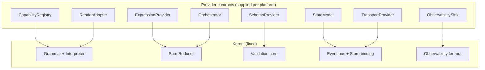

# GenUI Platform

A generic platform layer for **generative, declarative UI** — a kernel that interprets a
portable UI-intent document into a running, reactive interface, while delegating everything
domain- and framework-specific to pluggable providers.

> The kernel owns the *invariants* (grammar, validation, reduction). Everything domain-specific
> — which components exist, what data means, which LLM authors it, which framework renders it —
> is supplied as a **provider**. A concrete platform = **kernel + one implementation of each provider**.

## Status

Early implementation. The architecture and the wire protocol (**GenUI Protocol / GUP**) are
defined; the normative schemas + golden conformance fixture, a **reference kernel** (Phase 1), a
first **React render adapter** (Phase 2), and the **Orchestrator seam** for effectful actions
(Phase 3) are built and green.

| Decision | Outcome |
|---|---|
| Goal | Build a **generic platform layer**, not standardize an existing DSL |
| Kernel boundary | **Closed grammar**, open (provider-supplied) vocabulary |
| Interactions | A first-class **behavior edge**, not a second kernel |
| State | **Stateless events** by default; sequencing via a pure reducer + state-as-data |
| Delivery | **Protocol + kernel** (portable artifacts), not an in-process SDK |
| Reference kernel | **TypeScript/JS first**, JSONata as the default `ExpressionProvider` |
| First render adapter | **React** (`adapters/react/`), infra-agnostic per ADR-0006 |
| Effectful actions | **Orchestrator seam**: `invoke`/`confirm`/`navigate` as post-reduction effects; async data as machine states |

## What this is not

- Not a standardization of any one existing DSL, registry, or app. Prior systems that inspired
  this (a schema-driven card DSL, a component registry, an interpreter, a validation engine, an
  MCP orchestration layer) are treated as a **profile** — one instantiation of the platform, with
  live-cards as the **first profile to onboard** — not the platform itself.
- Not a UI framework. The platform is framework-agnostic; a framework binding is a *provider*.

## Repository map

```
genui-platform/
  README.md                     ← you are here
  docs/
    01-vision.md                ← the problem, the pivot, what we're building
    02-architecture.md          ← kernel/provider model, object model, invariants, pipeline
    03-protocol.md              ← the GenUI Protocol (GUP): the five wire messages
    04-first-onboarding-profile.md ← live-cards: the first profile to onboard (3-repo mapping)
    not-yet-decided.md          ← parked open decisions
    discussion-log.md           ← chronological record of the whole design conversation
    decisions/
      README.md                 ← ADR index
      ADR-0001-closed-grammar-kernel.md
      ADR-0002-interaction-as-edge.md
      ADR-0003-stateless-events-with-reducer.md
      ADR-0004-protocol-over-sdk.md
      ADR-0005-kernel-placement.md
      ADR-0006-render-adapter-infra-agnostic.md
      ADR-0007-reference-kernel-implementation.md
      ADR-0008-first-render-adapter-react.md
      ADR-0009-orchestrator-effects.md
  schemas/                      ← normative GUP JSON Schemas + golden conformance fixture
  kernel/                       ← Phase 1 reference kernel (TypeScript)
    src/                        ← types, providers, interpreter, reducer, kernel
    test/                       ← golden fixture + orchestrator effects executed through the kernel
    tsconfig.json
  adapters/
    react/                      ← Phase 2 React render adapter
      src/                      ← registry, renderer, controller, live-cards components, hook
      test/                     ← tree render, gate flip, event wiring, fallback
      tsconfig.json
```

## Core idea in one diagram



See [docs/01-vision.md](docs/01-vision.md) to start.
