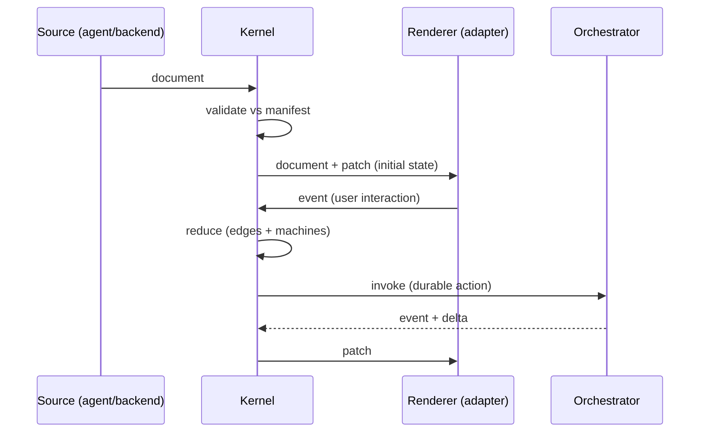

# 03 — GenUI Protocol (GUP)

Because delivery is **protocol + kernel** (not an in-process SDK — see
[ADR-0004](decisions/ADR-0004-protocol-over-sdk.md)), the Document and the state deltas are
**portable, language-neutral artifacts**. Every provider becomes a *conformance target*.

Working name: **GenUI Protocol (GUP)**. Draft version `0.1`.

## Envelope

Every message:

```json
{ "gup": "0.1", "type": "...", "payload": { } }
```

Transport-agnostic — it rides WebSocket, SSE, stdio, or in-proc. Transport is the
`TransportProvider`'s concern, not the protocol's.

## The five messages

### 1. `manifest` — capability vocabulary (the meta-DSL, on the wire)

Published once per domain; every other party validates against it.

```json
{ "type": "manifest", "payload": {
  "version": "1.0",
  "expression": "<dialect-id>",
  "namespaces": ["<ns>"],
  "actions": ["assign", "derive", "invoke", "emit", "navigate", "confirm"],
  "capabilities": {
    "<type>": {
      "propsSchema": { "$comment": "JSON Schema" },
      "emits": ["<event>"],
      "slots": ["children"]
    }
  }
}}
```

### 2. `document` — the portable UI-intent artifact

```json
{ "type": "document", "payload": {
  "root": {
    "capability": "<type>",
    "id": "<id>",
    "props": {},
    "edges": {
      "read":     { "<prop>": "<ns.path>" },
      "gate":     "<expr>",
      "on":       { "<event>": [ { "do": "<action>", "target": "<ns.path>", "args": {} } ] },
      "children": []
    }
  },
  "machines": [
    { "id": "<id>", "context": "<ns.path>", "initial": "<state>", "states": {} }
  ]
}}
```

The `render` edge is implicit in `capability`. Actions in `on` reference the closed action families.

### 3. `patch` — state deltas (kernel → renderer)

```json
{ "type": "patch", "payload": {
  "rev": 42,
  "ops": [ { "op": "set|merge|remove", "path": "<ns.path>", "value": null } ]
}}
```

### 4. `event` — interaction (renderer → kernel)

```json
{ "type": "event", "payload": { "node": "<id>", "name": "<event>", "payload": {} } }
```

### 5. `trace` — observability (kernel → sink)

```json
{ "type": "trace", "payload": {
  "event": "resolve|fallback|action|transition|validate",
  "node": "<id>", "detail": {}, "ts": 0
}}
```

## Protocol invariants

1. **Documents and patches are the only things that cross into a renderer.** A renderer needs no
   domain logic — it materializes a document and applies patches.
2. **Events are the only thing that cross back.** Renderers **never patch the store directly** —
   they emit events; the kernel reduces → emits patches. This preserves *validate-before-commit*
   and the *pure-reducer law* across the wire. (See
   [ADR-0004](decisions/ADR-0004-protocol-over-sdk.md) consequences.)
3. **The store is authoritative kernel-side; the renderer holds a projection** kept current by
   patches. `rev` provides ordering + optimistic concurrency.
4. **A document is valid only against a declared `manifest` version.** The manifest binds source,
   validator, renderer, and orchestrator to one contract.
5. **Transport- and placement-agnostic.** The same five messages work whether the kernel runs
   server-side (thin renderers) or embedded (in-proc bus). See
   [ADR-0005](decisions/ADR-0005-kernel-placement.md).

## Message flow



## Conformance targets

- **Renderer** is conformant if it consumes `document` + `patch`, emits `event`, and renders every
  `capability` in the `manifest`.
- **Orchestrator/agent** is conformant if it emits `document` and consumes/produces `event` + `patch`.
- **Validator** is conformant if it accepts/rejects documents strictly per the `manifest`.

## Planned first artifact

Pin the five messages as **normative, versioned JSON Schemas** plus a **golden conformance
fixture** (one manifest, one document, one event, the expected patch). Every kernel, renderer, and
orchestrator is then written *against* those schemas and verified by the fixture. Built and green in
the repo `schemas/` directory.

## Reference kernel (executable)

The golden fixture is not only schema-valid — it is **executed** by a reference kernel
(`kernel/`, TypeScript; see [ADR-0007](decisions/ADR-0007-reference-kernel-implementation.md)). The
kernel interprets a `document` (`gate → capability → props → children`), applies the pure reducer to
an `event` (`assign`/`derive`/`emit` plus declared machine transitions), enforces
validate-before-commit, and emits a `patch` byte-for-byte equal to the fixture's expected patch.
`invoke`/`navigate`/`confirm` are traced and deferred to the Orchestrator seam (Phase 3).
