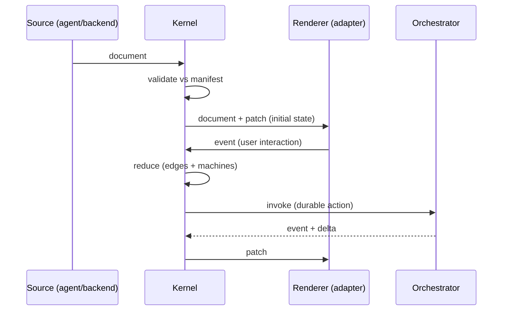

# 03 — GenUI Protocol (GUP)

Because delivery is **protocol + kernel** (not an in-process SDK — see
[ADR-0004](decisions/ADR-0004-protocol-over-sdk.md)), the Document and the state deltas are
**portable, language-neutral artifacts**. Every provider becomes a *conformance target*.

Working name: **GenUI Protocol (GUP)**. Draft version `0.1`.

## Envelope

Every message:

```json
{ "gup": "0.1", "type": "...", "payload": { } }
```

Transport-agnostic — it rides WebSocket, SSE, stdio, or in-proc. Transport is the
`TransportProvider`'s concern, not the protocol's.

## The five messages

### 1. `manifest` — capability vocabulary (the meta-DSL, on the wire)

Published once per domain; every other party validates against it.

```json
{ "type": "manifest", "payload": {
  "version": "1.0",
  "expression": "<dialect-id>",
  "namespaces": ["<ns>"],
  "actions": ["assign", "derive", "invoke", "emit", "navigate", "confirm"],
  "capabilities": {
    "<type>": {
      "propsSchema": { "$comment": "JSON Schema" },
      "emits": ["<event>"],
      "slots": ["children"]
    }
  }
}}
```

### 2. `document` — the portable UI-intent artifact

```json
{ "type": "document", "payload": {
  "root": {
    "capability": "<type>",
    "id": "<id>",
    "props": {},
    "edges": {
      "read":     { "<prop>": "<ns.path>" },
      "gate":     "<expr>",
      "on":       { "<event>": [ { "do": "<action>", "target": "<ns.path>", "args": {} } ] },
      "children": []
    }
  },
  "machines": [
    { "id": "<id>", "context": "<ns.path>", "initial": "<state>", "states": {} }
  ]
}}
```

The `render` edge is implicit in `capability`. Actions in `on` reference the closed action families.

### 3. `patch` — state deltas (kernel → renderer)

```json
{ "type": "patch", "payload": {
  "rev": 42,
  "ops": [ { "op": "set|merge|remove", "path": "<ns.path>", "value": null } ]
}}
```

### 4. `event` — interaction (renderer → kernel)

```json
{ "type": "event", "payload": { "node": "<id>", "name": "<event>", "payload": {} } }
```

### 5. `trace` — observability (kernel → sink)

```json
{ "type": "trace", "payload": {
  "event": "resolve|fallback|action|transition|validate",
  "node": "<id>", "detail": {}, "ts": 0
}}
```

## Protocol invariants

1. **Documents and patches are the only things that cross into a renderer.** A renderer needs no
   domain logic — it materializes a document and applies patches.
2. **Events are the only thing that cross back.** Renderers **never patch the store directly** —
   they emit events; the kernel reduces → emits patches. This preserves *validate-before-commit*
   and the *pure-reducer law* across the wire. (See
   [ADR-0004](decisions/ADR-0004-protocol-over-sdk.md) consequences.)
3. **The store is authoritative kernel-side; the renderer holds a projection** kept current by
   patches. `rev` provides ordering + optimistic concurrency.
4. **A document is valid only against a declared `manifest` version.** The manifest binds source,
   validator, renderer, and orchestrator to one contract.
5. **Transport- and placement-agnostic.** The same five messages work whether the kernel runs
   server-side (thin renderers) or embedded (in-proc bus). See
   [ADR-0005](decisions/ADR-0005-kernel-placement.md).

## Message flow



## Conformance targets

- **Renderer** is conformant if it consumes `document` + `patch`, emits `event`, and renders every
  `capability` in the `manifest`.
- **Orchestrator/agent** is conformant if it emits `document` and consumes/produces `event` + `patch`.
- **Validator** is conformant if it accepts/rejects documents strictly per the `manifest`.

## Planned first artifact

Pin the five messages as **normative, versioned JSON Schemas** plus a **golden conformance
fixture** (one manifest, one document, one event, the expected patch). Every kernel, renderer, and
orchestrator is then written *against* those schemas and verified by the fixture. Built and green in
the repo `schemas/` directory.

## Reference kernel (executable)

The golden fixture is not only schema-valid — it is **executed** by a reference kernel
(`kernel/`, TypeScript; see [ADR-0007](decisions/ADR-0007-reference-kernel-implementation.md)). The
kernel interprets a `document` (`gate → capability → props → children`), applies the pure reducer to
an `event` (`assign`/`derive`/`emit` plus declared machine transitions), enforces
validate-before-commit, and emits a `patch` byte-for-byte equal to the fixture's expected patch.
`invoke`/`navigate`/`confirm` are surfaced as **effects** the kernel runs against the Orchestrator
provider after reduction (see below).

## Reference render adapter (React)

A first `RenderAdapter` (`adapters/react/`; see
[ADR-0008](decisions/ADR-0008-first-render-adapter-react.md)) closes the loop end to end: it renders
the resolved `document` tree to React elements (honoring `gate` visibility, read-bound props, and a
graceful fallback for unknown capabilities), and emits `event`s back through a controller that
dispatches to the kernel and re-resolves. Renderers never patch the store — they only emit events —
upholding the protocol invariant.

## Reference Orchestrator (effects)

`invoke`/`confirm`/`navigate` are effectful, so the pure reducer only *records* them; the kernel
runs them against an **Orchestrator** provider after reduction (see
[ADR-0009](decisions/ADR-0009-orchestrator-effects.md)). The Orchestrator owns time and I/O and
returns store `ops` and/or follow-up `event`s, which the kernel applies and **settles within the same
dispatch** — one `event` in, one `rev` out, regardless of fan-out. **Async data is modeled as machine
states** (`idle → loading → ready`): the triggering event moves the machine to `loading`; the
Orchestrator's follow-up event moves it to `ready`. The default `NullOrchestrator` performs nothing,
so a document referencing tools runs harmlessly before wiring exists. `emit` stays internal to the
reducer's queue; only `invoke`/`confirm`/`navigate` cross the Orchestrator boundary.

## Reference transport (the wire, exercised)

A `TransportProvider` seam (`kernel/transport.ts`; see
[ADR-0010](decisions/ADR-0010-transport-seam.md)) carries the five messages as **GUP envelopes**
across a boundary — `send(message)` / `subscribe(listener)`, nothing kernel-specific. A
`KernelTransportHost` binds a kernel to a transport: on `start()` it publishes `manifest → document →`
init `patch`, then for each inbound `event` it dispatches and sends back the resulting `patch`
(inbound dispatch is serialized so `rev` stays monotonic; non-`event` messages are ignored). A
reference `createInMemoryTransportPair()` exercises the full *serialize → deliver → deserialize* loop
headlessly, proving ADR-0004 (protocol, not SDK) without a network. Concrete network bindings
(SSE/WebSocket/stdio) reuse this exact seam.

## Reference client runtime (renders from the wire)

The renderer-side half is a `GenUIClient` (`kernel/client.ts`; see
[ADR-0011](decisions/ADR-0011-client-runtime.md)) that never sees the kernel. It consumes `manifest`
(→ builds its registry + an empty replica for the declared namespaces), `document` (→ the tree to
interpret), and each `patch` (→ applied to the replica), then runs the **pure interpreter**
(`resolveNode`) locally and notifies subscribers; it emits `event`s back over the transport. The
read/write split is explicit: the **authoritative reducer stays on the host**, while **interpret + a
state replica live on the client** (reads are pure and safe to duplicate; writes are not). Initial
sync uses `Kernel.baseline()` — a rev-0 patch carrying the *full* state snapshot — so a fresh client
reconstructs a complete replica from one patch, then stays current via incremental patches.

Reconnection is handled beneath the five messages (see
[ADR-0012](decisions/ADR-0012-reconnection.md)): the host is a **broker** that broadcasts each patch
to every attached connection and keeps a bounded **patch log**. A client attaches with an optional
`fromRev`; if the host still holds the patches after it, only those deltas are **replayed** (the
client keeps its replica), otherwise the client is **full-resynced** (`manifest → document →`
full-snapshot patch at the current rev). No new GUP message is introduced — the client conveys its
`rev` through the transport, and patch application is idempotent.

## Reference authoring (agents compose documents)

Agents produce documents from manifest vocabulary via typed builders (`kernel/authoring.ts`; see
[ADR-0013](decisions/ADR-0013-agent-authoring.md)) rather than hand-writing JSON: `node(...)`,
`document(...)`, and one constructor per action family (`assign`/`derive`/`emit`/`invoke`/`navigate`/
`confirm`, plus `guarded`). Two safety nets follow, with a deliberate split — **structure throws,
references lint**: `authorDocument(...)` runs **validate-before-commit** (schema validation; throws on
a malformed document), while `lintManifestReferences(...)` returns **non-throwing** warnings for
references that are valid in shape but not backed by the manifest (unknown capability, undeclared
event, undeclared namespace). Unknown capabilities are intentionally *not* fatal — the interpreter
resolves them to a fallback node, so forward-referencing a capability a given renderer hasn't shipped
degrades gracefully instead of crashing.

## Reference network transport (HTTP + SSE)

The first *concrete* transport binding lives in `transports/http-sse/` (see
[ADR-0014](decisions/ADR-0014-http-sse-transport.md)), deliberately outside the portable kernel core.
SSE carries host → client messages (`manifest`/`document`/`patch`/`trace`) over `GET {path}/stream`;
the single client → host message (`event`) is an ordinary `POST {path}/event`. The stream returns a
session id in the `X-GUP-Session` header which the client echoes on its POSTs for correlation — no new
GUP message. Reconnection rides the query string: `GET {path}/stream?fromRev=N` maps onto the broker's
resume path for an incremental replay. `GenUIClient` and `KernelTransportHost` are used unchanged —
only new `TransportProvider` implementations — which is the point of the seam.
