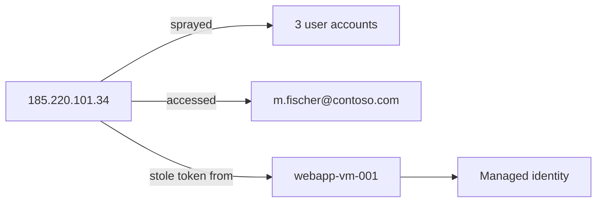

# Investigation Report — Incident 68b54272-f60b-53fa-b3d4-2494c7bd598d

## Verdict

**Incident Classification:** True Positive  
**Incident Determination:** Other  
**Confidence:** High

## Summary

During 2026-07-17 23:09:23 – 2026-07-17 23:09:24, a confirmed attack from `185.220.101.34` progressed through Credential Access and Collection. Data access was confirmed.

The source performed a password spray against three accounts, accessed `m.fischer@contoso.com` through Microsoft Graph, and obtained a managed identity token through IMDS on `webapp-vm-001`.

## Attack Graph

## Correlated Alerts

| Alert | Verdict | Evidence |
|---|---|---|
| Password Spray from Tor Exit Node | True Positive | 14 failed sign-ins targeting 3 accounts |
| Rapid Mailbox Enumeration via Graph API | True Positive | 12 mailbox items read across four operations |
| Unusual metadata service access | True Positive | Managed identity token obtained through IMDS |

## Timeline

| Time | Event | Confidence |
|---|---|---|
| 23:09:23 | 14 failed ROPC sign-ins targeted `j.bauer`, `l.schneider`, and `m.fischer` from `185.220.101.34`. | High |
| 23:09:23 | Four Graph operations read three items each from `m.fischer@contoso.com`. | High |
| 23:09:24 | IMDS issued an Azure Resource Manager token from `webapp-vm-001` using `curl/8.5.0`. | High |

## Compromised Entities

- **m.fischer@contoso.com** — affected mailbox; targeted and accessed.
- **11111111-2222-3333-4444-555555555555** — compromised managed identity.
- **webapp-vm-001** — affected virtual machine hosting the IMDS request.
- **j.bauer@contoso.com** and **l.schneider@contoso.com** — accounts targeted by the spray.

## TTPs and Key Activities

- **T1110.003 — Password Spraying:** credential guessing across multiple accounts through ROPC.
- **T1114.002 — Remote Email Collection:** mailbox items collected through Microsoft Graph.
- **T1552.005 — Cloud Instance Metadata API:** managed identity token obtained from IMDS.

## IOCs

- Public IP: `185.220.101.34`
- Client application: `outlook-client-app-id`
- Workload: `webapp-vm-001`

## Recommended Actions

1. Reset targeted account credentials, revoke sessions, and enforce phishing-resistant MFA.
2. Review Graph consent, mailbox audit history, forwarding rules, and accessed finance content.
3. Isolate `webapp-vm-001`, rotate the managed identity path, and determine how IMDS became reachable.