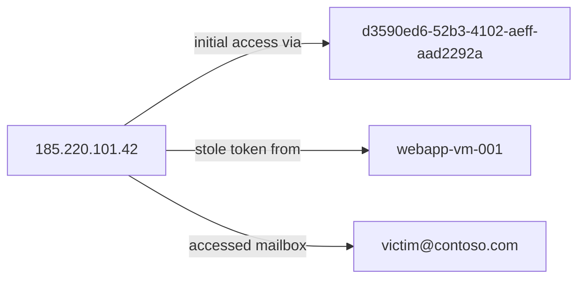

# Investigation Report — Incident 5b170d32-9ca0-51f3-a6c5-6c05d0df696d

## Verdict

**Incident Classification:** True Positive
**Incident Determination:** Other
**Confidence:** High

## Summary

During 2026-07-17 22:58:30 – 2026-07-17 22:58:32, confirmed true-positive attack from 185.220.101.42 progressing through Initial Access, Credential Access, Collection. Data access/exfiltration confirmed. Total observable events: 6.

The incident is classified as True Positive / Other because Confirmed malicious attack with successful sensitive data access.

## Attack Graph

### Correlated Incidents and Alerts

| Incident | Alert | Alert verdict | Relationship to seed | Reason / evidence |
|---|---|---|---|---|
| 5b170d32-9ca0-51f3-a6c5-6c05d0df696d | Device Code Flow Authentication (IA-ALERT-001) | True Positive | Original Incident | Device-code authentication completed from 185.220.101.42 |
| 5b170d32-9ca0-51f3-a6c5-6c05d0df696d | Unusual metadata service access (IA-ALERT-002) | True Positive | Original Incident | Managed identity token obtained via IMDS from 185.220.101.42 (resource: hxxps://graph[.]microsoft[.]com) |
| 5b170d32-9ca0-51f3-a6c5-6c05d0df696d | Anomalous data access on a messaging resource (IA-ALERT-003) | True Positive | Original Incident | Mailbox access: 3 items read from victim@contoso.com |
| 5b170d32-9ca0-51f3-a6c5-6c05d0df696d | Anomalous data access on a messaging resource (IA-ALERT-004) | True Positive | Original Incident | Mailbox access: 3 items read from victim@contoso.com |
| 5b170d32-9ca0-51f3-a6c5-6c05d0df696d | Anomalous data access on a messaging resource (IA-ALERT-005) | True Positive | Original Incident | Mailbox access: 3 items read from victim@contoso.com |
| 5b170d32-9ca0-51f3-a6c5-6c05d0df696d | Anomalous data access on a messaging resource (IA-ALERT-006) | True Positive | Original Incident | Mailbox access: 3 items read from victim@contoso.com |

## Timeline

| Time | Description | Analysis / Pivot | Confidence |
|---|---|---|---|
| 2026-07-17 22:58:30 | Device-code authentication completed from 185.220.101.42. Alerts: IA-ALERT-001. AADSignInLogs: at 2026-07-17 22:58:30: OperationName=Sign-in activity, ResultDescription=Device code authentication completed, ResultType=0, IPAddress=185.220.101.42, AppId=d3590ed6-52b3-4102-aeff-aad2292ab01c, CorrelationId=b60cf603-93d8-4899-8600-f933f4a2b4cd, ResourceId=d3590ed6-52b3-4102-aeff-aad2292ab01c, AuthenticationProtocol=deviceCode, ResourceDisplayName=Device Code App. | Correlated evidence from AADSignInLogs. | High |
| 2026-07-17 22:58:31 | Managed identity token obtained via IMDS from 185.220.101.42 (resource: hxxps://graph[.]microsoft[.]com). Alerts: IA-ALERT-002. AzureIMDSAccessLogs: at 2026-07-17 22:58:31: OperationName=IMDS.GetToken, ResultType=Success, CallerIpAddress=185.220.101.42, CorrelationId=ef51d0b3-a572-4466-8422-02fd07d161a0, ResourceId=/SUBSCRIPTIONS/12345678-1234-1234-1234-123456789ABC/RESOURCEGROUPS/PRODUCTION-RG/PROVIDERS/MICROSOFT.COMPUTE/VIRTUALMACHINES/WEBAPP-VM-001, Properties.clientId=11111111-2222-3333-4444-555555555555, Properties.endpoint=/metadata/identity/oauth2/token?resource=hxxps://graph[.]microsoft[.]com&identity=system-assigned, Properties.resource=hxxps://graph[.]microsoft[.]com, Properties.userAgent=curl/8.5.0, Properties.vmName=webapp-vm-001, Category=InstanceMetadata. | Correlated evidence from AzureIMDSAccessLogs. | High |
| 2026-07-17 22:58:31 | Mailbox access: 3 items read from victim@contoso.com. Alerts: IA-ALERT-003, IA-ALERT-004, IA-ALERT-005, IA-ALERT-006. OfficeActivity: at 2026-07-17 22:58:31: ResultStatus=Succeeded, AppId=58538002-3eda-4c5f-92c2-b5d4dec799dd, MailboxOwnerUPN=victim@contoso.com, Operation=MailItemsAccessed, OperationCount=3. | Correlated evidence from OfficeActivity. | High |
| 2026-07-17 22:58:32 | Mailbox access: 3 items read from victim@contoso.com. Alerts: IA-ALERT-003, IA-ALERT-004, IA-ALERT-005, IA-ALERT-006. OfficeActivity: at 2026-07-17 22:58:32: ResultStatus=Succeeded, AppId=bf639aa2-d2f3-4a61-96e7-3938ded3cf02, MailboxOwnerUPN=victim@contoso.com, Operation=MailItemsAccessed, OperationCount=3. | Correlated evidence from OfficeActivity. | High |
| 2026-07-17 22:58:32 | Mailbox access: 3 items read from victim@contoso.com. Alerts: IA-ALERT-003, IA-ALERT-004, IA-ALERT-005, IA-ALERT-006. OfficeActivity: at 2026-07-17 22:58:32: ResultStatus=Succeeded, AppId=8b0501d4-7825-4e2c-9c97-453f1bc6f6b3, MailboxOwnerUPN=victim@contoso.com, Operation=MailItemsAccessed, OperationCount=3. | Correlated evidence from OfficeActivity. | High |
| 2026-07-17 22:58:32 | Mailbox access: 3 items read from victim@contoso.com. Alerts: IA-ALERT-003, IA-ALERT-004, IA-ALERT-005, IA-ALERT-006. OfficeActivity: at 2026-07-17 22:58:32: ResultStatus=Succeeded, AppId=f6db002e-f2be-4a5b-a809-1936272a6631, MailboxOwnerUPN=victim@contoso.com, Operation=MailItemsAccessed, OperationCount=3. | Correlated evidence from OfficeActivity. | High |

## Compromised Entities

| Type | Main Identifier | Additional Identifiers | Role | Status | Description | Confidence |
|---|---|---|---|---|---|---|
| Cloud App | d3590ed6-52b3-4102-aeff-aad2292ab01c | 185.220.101.42 |  | Compromised | Credential compromised during initial access. AADSignInLogs: at 2026-07-17 22:58:30: OperationName=Sign-in activity, ResultDescription=Device code authentication completed, ResultType=0, IPAddress=185.220.101.42, AppId=d3590ed6-52b3-4102-aeff-aad2292ab01c, CorrelationId=b60cf603-93d8-4899-8600-f933f4a2b4cd, ResourceId=d3590ed6-52b3-4102-aeff-aad2292ab01c, AuthenticationProtocol=deviceCode, ResourceDisplayName=Device Code App | High |
| Managed Identity | 11111111-2222-3333-4444-555555555555 | hxxps://graph[.]microsoft[.]com /SUBSCRIPTIONS/12345678-1234-1234-1234-123456789ABC/RESOURCEGROUPS/PRODUCTION-RG/PROVIDERS/MICROSOFT.COMPUTE/VIRTUALMACHINES/WEBAPP-VM-001 webapp-vm-001 |  | Compromised | Credential compromised during credential access. AzureIMDSAccessLogs: at 2026-07-17 22:58:31: OperationName=IMDS.GetToken, ResultType=Success, CallerIpAddress=185.220.101.42, CorrelationId=ef51d0b3-a572-4466-8422-02fd07d161a0, ResourceId=/SUBSCRIPTIONS/12345678-1234-1234-1234-123456789ABC/RESOURCEGROUPS/PRODUCTION-RG/PROVIDERS/MICROSOFT.COMPUTE/VIRTUALMACHINES/WEBAPP-VM-001, Properties.clientId=11111111-2222-3333-4444-555555555555, Properties.endpoint=/metadata/identity/oauth2/token?resource=hxxps://graph[.]microsoft[.]com&identity=system-assigned, Properties.resource=hxxps://graph[.]microsoft[.]com, Properties.userAgent=curl/8.5.0, Properties.vmName=webapp-vm-001, Category=InstanceMetadata | High |
| Virtual Machine | /SUBSCRIPTIONS/12345678-1234-1234-1234-123456789ABC/RESOURCEGROUPS/PRODUCTION-RG/PROVIDERS/MICROSOFT.COMPUTE/VIRTUALMACHINES/WEBAPP-VM-001 | webapp-vm-001 11111111-2222-3333-4444-555555555555 hxxps://graph[.]microsoft[.]com |  | Affected | Resource involved in credential access. AzureIMDSAccessLogs: at 2026-07-17 22:58:31: OperationName=IMDS.GetToken, ResultType=Success, CallerIpAddress=185.220.101.42, CorrelationId=ef51d0b3-a572-4466-8422-02fd07d161a0, ResourceId=/SUBSCRIPTIONS/12345678-1234-1234-1234-123456789ABC/RESOURCEGROUPS/PRODUCTION-RG/PROVIDERS/MICROSOFT.COMPUTE/VIRTUALMACHINES/WEBAPP-VM-001, Properties.clientId=11111111-2222-3333-4444-555555555555, Properties.endpoint=/metadata/identity/oauth2/token?resource=hxxps://graph[.]microsoft[.]com&identity=system-assigned, Properties.resource=hxxps://graph[.]microsoft[.]com, Properties.userAgent=curl/8.5.0, Properties.vmName=webapp-vm-001, Category=InstanceMetadata | High |
| Mailbox | victim@contoso.com | 58538002-3eda-4c5f-92c2-b5d4dec799dd |  | Affected | Impacted asset targeted during collection. OfficeActivity: at 2026-07-17 22:58:31: ResultStatus=Succeeded, AppId=58538002-3eda-4c5f-92c2-b5d4dec799dd, MailboxOwnerUPN=victim@contoso.com, Operation=MailItemsAccessed, OperationCount=3 | High |

## TTPs and Key Activities

| Tactic | Technique | Technique ID | Activity Description | Confidence |
|---|---|---|---|---|
| Initial Access | Phishing: Spearphishing Link (Device Code) | T1566.002 | AADSignInLogs: at 2026-07-17 22:58:30: OperationName=Sign-in activity, ResultDescription=Device code authentication completed, ResultType=0, IPAddress=185.220.101.42, AppId=d3590ed6-52b3-4102-aeff-aad2292ab01c, CorrelationId=b60cf603-93d8-4899-8600-f933f4a2b4cd, ResourceId=d3590ed6-52b3-4102-aeff-aad2292ab01c, AuthenticationProtocol=deviceCode, ResourceDisplayName=Device Code App | High |
| Credential Access | Unsecured Credentials: Cloud Instance Metadata API | T1552.005 | AzureIMDSAccessLogs: at 2026-07-17 22:58:31: OperationName=IMDS.GetToken, ResultType=Success, CallerIpAddress=185.220.101.42, CorrelationId=ef51d0b3-a572-4466-8422-02fd07d161a0, ResourceId=/SUBSCRIPTIONS/12345678-1234-1234-1234-123456789ABC/RESOURCEGROUPS/PRODUCTION-RG/PROVIDERS/MICROSOFT.COMPUTE/VIRTUALMACHINES/WEBAPP-VM-001, Properties.clientId=11111111-2222-3333-4444-555555555555, Properties.endpoint=/metadata/identity/oauth2/token?resource=hxxps://graph[.]microsoft[.]com&identity=system-assigned, Properties.resource=hxxps://graph[.]microsoft[.]com, Properties.userAgent=curl/8.5.0, Properties.vmName=webapp-vm-001, Category=InstanceMetadata | High |
| Collection | Remote Email Collection | T1114.002 | OfficeActivity: at 2026-07-17 22:58:31: ResultStatus=Succeeded, AppId=58538002-3eda-4c5f-92c2-b5d4dec799dd, MailboxOwnerUPN=victim@contoso.com, Operation=MailItemsAccessed, OperationCount=3 | High |

## IOCs and Evidence

| Type | Main Identifier | Additional Identifiers | Description | Confidence |
|---|---|---|---|---|
| Public IP | 185.220.101.42 | none | Observed in Initial Access | High |
